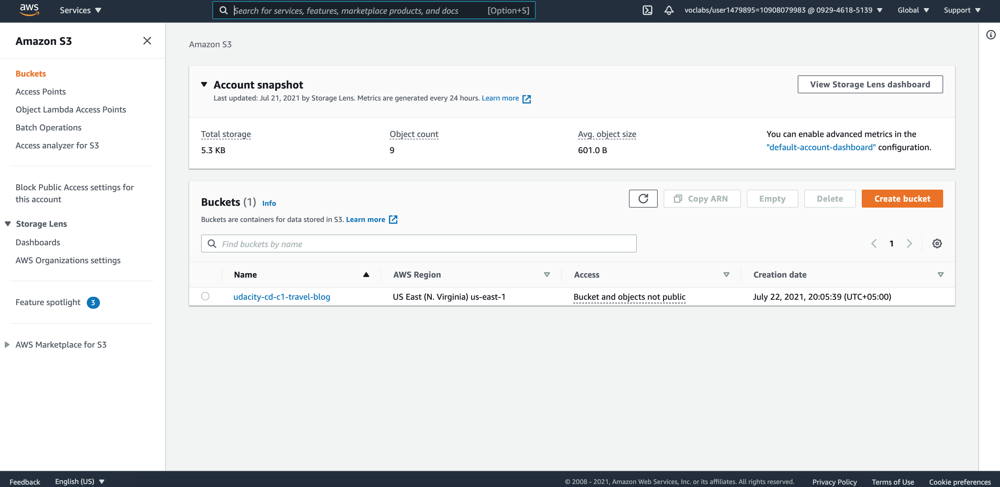
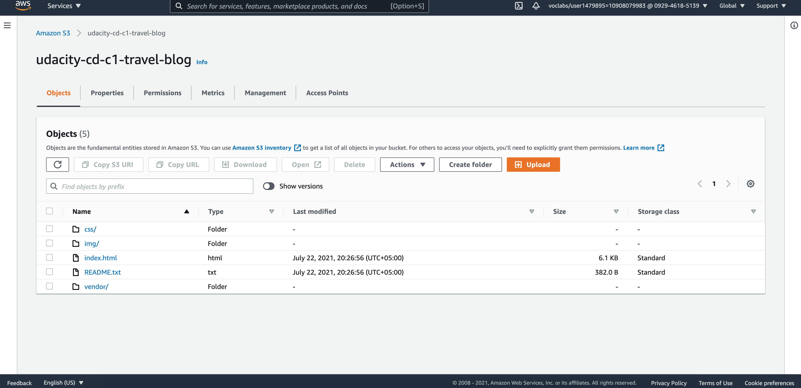
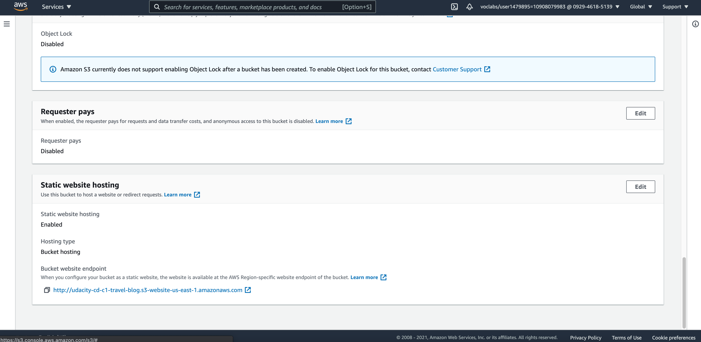
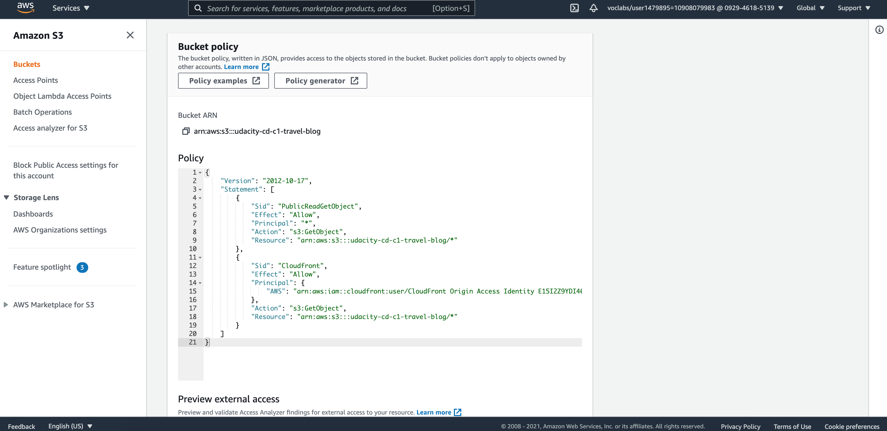
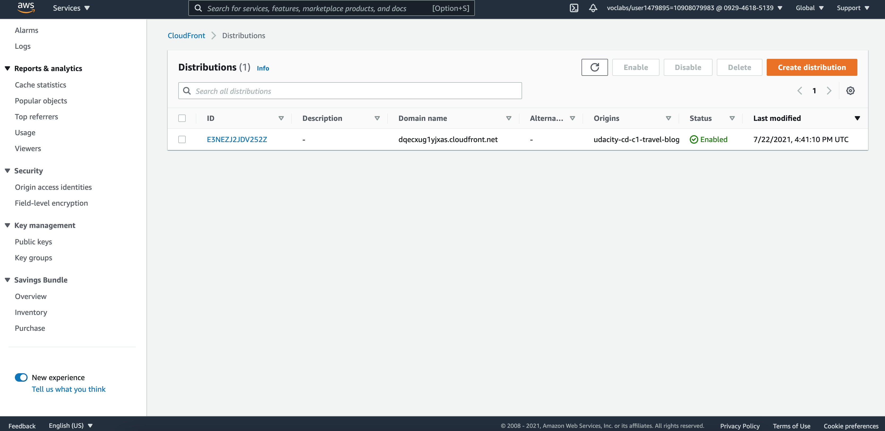

# Udacity Cloud Developer Nanodegree

Project submission: **Deploy Static Website on AWS**

## RUBRIC

1. **The student has created a S3 bucket.**

2. **All website files should be added to the S3 bucket.**

3. **The bucket configuration should be set up to support static website hosting.**

4. **The permission access to the bucket should be configured.**

    > One thing to add: We don't need to make this bucket 'public' since we are gonna hook it upto to Cloudfront anyway, and it automatically takes care of this via second bucket policy in the image above.
    >
    > But I am making it public as well because it is specified in the rubric.

5. **The website should be distributed via Cloudfront.**

6. **Is the website publicly accessible?**

* Cloudfront domain name: <https://dqecxug1yjxas.cloudfront.net>
* S3 Website-endpoint URL: <http://udacity-cd-c1-travel-blog.s3-website-us-east-1.amazonaws.com>
